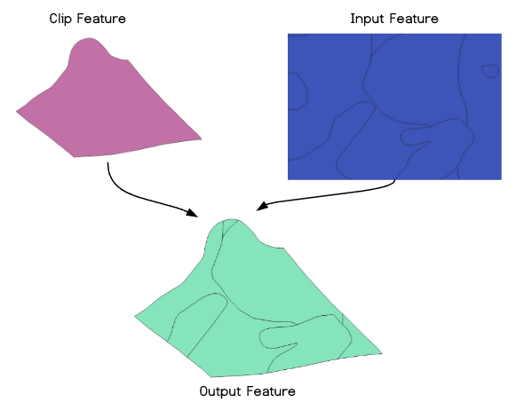

# gdalClip

Clip geometries between two datasets while maintain the attributes from both.

## Dependencies

* [gdal](https://www.npmjs.com/package/gdal)
* [uuid](https://www.npmjs.com/package/uuid)

## Setup

```bash
npm install gdalclip
```

## Usage

```bash
const data = gdalClip.processData(<clipFeature>, <inputFeature>, <outputName>, <outputFormat>);
```

* clipFeature: Must be Polygon or MultiPolygon.
* inputFeature: Polygon/MultiPolygon/Point/MultiPoint/Linestring/MultiLinestring
* outputName: Path and output name for the new file [DEFAULT: shapefile with random name].
* outputFromat: Output format that wil be used to save the data [DEFAULT: ESRI Shapefile].

## Sample Usage

```bash
const gdalClip = require('gdalclip');
const gdal = require('gdal');

const getFeatures = dataset => gdal.open(dataset).layers.get(0);

const baseData = getFeatures('path/to/baseData.shp');
const clipData = getFeatures('path/to/clipData.shp');

gdalClip.processData(clipData, baseData, 'path/to/outputData.shp', 'ESRI Shapefile');
```

## Allowed Outputs

Tested with the most common outputs that are listed on [gdal](https://www.npmjs.com/package/gdal). Message me on GitHub if you need some help or find some bug.

You can also use [vsimem](http://www.gdal.org/gdal_virtual_file_systems.html) to save the data temporary on the memory. So the command would be something like:

```bash
const singleParts = gdalClip.processData.processData(inputLayer, '/vsimem/temp_output.shp', 'ESRI Shapefile')
```

## Ilustration



---

=^]
